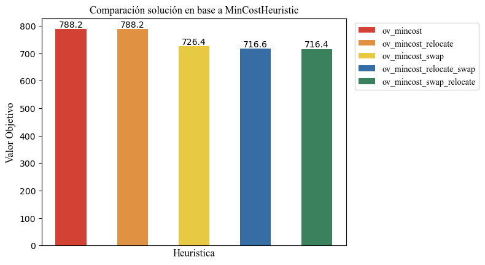
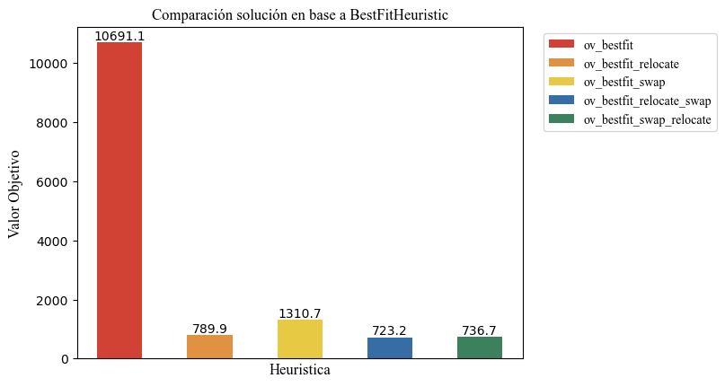
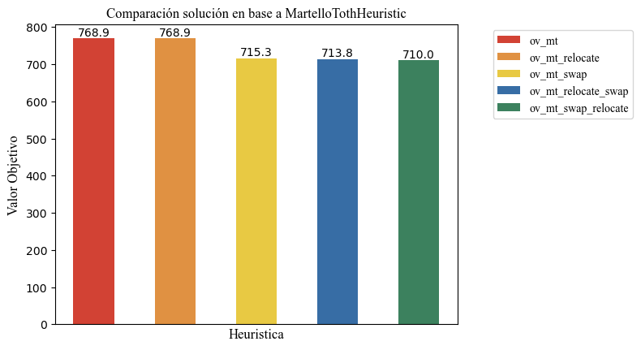

\break
```{=latex}
\setcounter{tocdepth}{2}
\tableofcontents
```
\break

# Introducción

## Contexto

En los últimos años, el e-commerce ha crecido de manera exponencial en el mundo, incluyendo nuestra región. Las empresas, como en cualquier otro rubro, buscan reducir sus costos operativos, con el objetivo de obtener un mayor margen de ganancia. Para vendedores con un gran volumen de ventas, se suelen planificar visitas para recolectar los productos, pero realizar esta acción con muchos vendedores pequeños (que no realizan tantas ventas) es muy costoso en terminos logísticos, por lo que se les suele encargar a ellos que entreguen los paquetes a un punto de recolección de la empresa (usualmente llamado _primera milla_).

## El problema y la decisión a tomar

El trabajo nos pone en el contexto de consultores de la empresa **ThunderPack** que provee servicios logísticos y además ofrece la posibilidad a otras empresas logísticas de almacenar paquetes en depósitos (puntos) de ThunderPack para que luego las mismas pasen a recogerlos por dichos puntos (la primera milla ya no seria un depósito propiedad de la empresa si no un depósito alquilado).

ThunderPack actualmente tiene un sistema donde los vendedores eligen a que depósito mandan los paquetes y pueden cambiarlo sin previo aviso. La empresa ha realizado estudios y nota que muchas veces esto resulta en un uso ineficiente de su red de depósitos, por lo que consideran cambiarse a una modalidad centralizada donde cada vendedor tendrá su depósito asignado al cual hará envios regularmente. Estas asignaciones se harán buscando maximizar la demanda y minimizar las distancias que los vendedores recorren.

La empresa tiene tres preguntas que querría idealmente responder:

- "¿Es suficiente la capacidad de la red de depósitos, o es necesario expandir la misma para poder dar respuesta a todos los vendedores?"
- "¿Es posible encontrar una asignación donde los vendedores recorran una distancia razonable
para entregar sus paquetes?"
- "¿Es factible desarrollar una herramienta que nos permita experimentar con distintos escenarios
y obtener soluciones de buena calidad en unos pocos minutos?"

Al final de este informe, con modelos para el problema y análisis sobre los mismos, buscaremos responder estas preguntas.

## El modelo

El problema será modelado mediante el Problema de Asignación Generalizada (GAP), el cual formularemos para el contexto de **ThunderPack** de la siguiente manera. Sea $N = \{1, \ldots, n\}$ el conjunto de vendedores y $M = \{1, \ldots, m\}$ el conjunto de depósitos, cada depósito $i\in M$ tiene una capacidad máxima de $c_i$. Dado un vendedor $j \in N$ y un depósito $i \in M$, $d_{ij}$ determina la demanda y $c_{ij}$ la distancia a recorrer del vendedor $j$ en caso de ser asignado al depósito $i$. Una vez definidos los elementos, podemos representar a la solución como los conjuntos $\Gamma_1, \ldots, \Gamma_m \subseteq N$, con $\Gamma_i$ el conjunto de vendedores asignados al depósito $i \in M$. Así, el problema consiste en:

1. Asignar cada vendedor $j \in N$ a exáctamente un depósito $i \in M$, es decir que $, \Gamma_i \cap \Gamma_k = \emptyset \text{ si } i \neq k, i, k \in M$

2. No se debe superar la capacidad de cada depósito, es decir que para cada $i\in M$:
$$\sum_{j \in \Gamma_i} d_{ij} \leq c_i$$ 

3. Minimizar la distancia total de la asignación:
$$\sum_{i=1}^{n} \sum_{j \in \Gamma_i} c_{ij}$$

Además, es importante notar que dependiendo las capacidades y demandas dadas, podría dificultarse encontrar una solución factible. Definimos: 
$$c_{\text{max}} = \max_{i \in M, j \in N} c_{ij}$$
como la distancia máxima posible a recorrer por cada vendedor. Podríamos tener soluciones parciales en las cuales haya vendedores que no sean asignados a ningún depósito, en aquellos casos se tomará una penalización de $3 \times c_{max}$ para cada uno. 

# Heuristicas Constructivas

Se pueden plantear diferentes heurísticas para resolver el problema de GAP. En principio, necesitaremos heuristicas constructivas para obtener soluciones factibles pero seguramente no óptimas en un tiempo considerablemente bajo. Para ello, proponemos tres heuristicas constructivas distintas.

## Mejor ajuste

La idea de esta heurística consiste en asignar a cada vendedor con el depósito factible (cuya capacidad $c_i$ sea mayor o igual a la demanda $d_{ij}$) con menor capacidad disponible en el momento de la asignación. En la implementación de la misma seguimos determinados pasos:
1. Tomar un vendedor $j \in N$.
2. Asignarlo al depósito $i\in M$ con menor capacidad factible. 
4. Actualizar la capacidad $c_j$ del depósito disminuyendole la demanda $d_{ij}$ del vendedor asignado. 
3. Repetir para todos los vendedores. 
4. Para todos los vendedores no asignados (en el caso de que hayan), sumo la penalidad de no poder asignarlos.
Notar que la heurística será muy útil en los casos donde el depósito con menor capacidad coincida con uno de los más cercanos al vendedor, sin embargo, en los casos donde esto no ocurra, es muy probable que determinados vendedores se queden sin asignar por la distancia máxima y por lo tanto suframos muchas penalizaciones.

## Distancia mínima

La primera heuristica construcvitva que planteamos consiste en asignar a cada vendedor con el almacén que menos distancia supone, sin excedernos de su respectiva capacidad. El procedimiento de la heurística consiste en los siguientes pasos: 

1. Tomar un vendedor $j \in N$.
2. Asignarlo al depósito $i\in M$ más cercano factible, es decir, cuya capacidad $c_i$ sea mayor o igual a la demanda $d_{ij}$. 
4. Actualizar la capacidad $c_j$ del depósito disminuyendole la demanda $d_{ij}$ del vendedor asignado. 
3. Repetir para todos los vendedores. 
4. Para todos los vendedores no asignados (en el caso de que hayan), sumo la penalidad de no poder asignarlos.

Esta estrategia es totalmente válida. Sin embargo, es posible que existan casos donde tener que recurrir a otro depósito debido a que el más cercano no es factible sea muy costoso y por lo tanto aumente considerablemente el valor de nuestra función objetivo. Por este motivo presentamos un enfoque similar pero ajustado en la próxima heurística. 

## Martello & Toth

La idea de esta heurística fue tomada del paper "A class of greedy algorithms" donde se mencioa la heuristica idea por los autores Martello y Toth. En este caso, para cada vendedor $j \in N$, bucasmos los dos depósitos $l, k \in M$ más cercanos, y además, computamos la diferencia entre estas distancias, es decir, calculamos $dif = d_{kj} - d_{lj}$ siendo $l$ el depósito más cercano al vendedor $j$ y $k$ el segundo más cercano. 

Luego, ordenamos los vendedores en base a las diferencias calculadas y los asignamos en este orden, es decir, aquellos vendedores con mayor diferencia serán asignados a su mejor depósito primero (si es que este es aún factible). 

La lógica detrás de esta heurística es que al calcular los dos mejores depósitos (en base a menor distancia) para cada vendedor y luego obtener la diferencia, podemos tener en cuenta aquellos vendedores cuyo costo de no poder ser asignados en su mejor opción (desición local) sea mayor asignándolos primero. Esto puede suponer importantes mejoras, debido a que nos aseguramos que aquellos vendedores que por capacidad se vean forzados a ir a su segundo depósito más cercano, no causarán un aumento significativo en el valor objetivo.

## Implementaciones y decisiones de diseño

Para la implementación de estas heuristicas constructivas buscamos modularizar el problema en varias clases.

En primer lugar, definimos la clase $\textit{GapInstance}$ que dado un archivo de una instancia toma los valores necesarios y los pone a disposición en distintas variables para resolver el problema. Estas son: 
- $m$: la cantidad de depósitos.
- $n$: la cantidad de vendedores/clientes.
- $demands$: una matriz de cuyas entradas indican la demanda correspondiente a asignar el cliente $j \in \{1,\ldots,n\}$ al depósito $i \in \{1,\ldots,m\}$.
- $costs$: una matriz cuyas entradas indican el costo (medido en distancia) correspondiente a asignar el cliente $j \in \{1,\ldots,n\}$ al depósito $i \in \{1,\ldots,m\}$.
- $capacities$: vector con las capacidades de los depósitos donde $|capacities| = m$.

En segundo lugar, definimos la clase $\textit{GapSolution}$ que dada una $instancia$ presenta los siguientes atributos y métodos:
- $deposits$: vector de vectores donde almacenaremos la asignación de vendedores a depósitos. Notar que definiremos un "depósito extra" para guardar los vendedores que no pudieron ser asignados. Esto será útil a la hora de realizar busqueda local, pues tendremos en cuenta a los vendedores que no asignamos y si logramos asignar mas nos ahorraremos penalidades.
- $currentCapacities$: un vector donde indicamos las capadidades remanentes para cada depósito. De esta forma podremos verificar la factibilidad de las asignaciones en $O(1)$.
- $objective\_value$: valor objetivo de la solución.
- $solution\_time$: tiempo de ejecución de la solución.
- $\textit{assign(i, j)}$: método para asignar el vendedor j al depósito i.
- $\textit{unassign(i, j)}$: método para desasignar el vendedor j al depósito i.

Por último, definimos la clase $GapSolver$ que dada una instancia crea un objeto de tipo $GapSolution$ y cuenta con el método $\textit{isFeasible(i, j)}$ que verifica si la asignación del vendedor $j$ al depósito $i$.

La clase $GapSolver$ será la clase base de todas las clases derivadas para cada una de las heurísticas constructivas, operadores de búsqueda local y la metaheurística. Esto nos permitirá una mejor modularización de las distintas estrategias. Las clases derivadas para resolver las heurísticas constructivas son:

- $MinCostHeuristic$ cuyo método $solve()$ aplica los pasos indicados previamente.
- $BestFitHeuristic$ cuyo método $solve()$ ejecuta el procedimiento señalado anteriormente.
- $MartelloTothHeuristic$ cuyo método $solve()$ sigue la idea de los autores.

# Operadores de búsqueda local

Una vez obtenidas nuestras soluciones inciales factibles, buscaremos mejorarlas con operadores de búsqueda local. En este caso planteamos el operador **Swap** y **Relocate**. Para ambos, la condición para movernos de una solución a otra será el criterio de aceptación de $\text{best improvement}$. Es decir, sea $s$ la solución, tomaremos la $\text{s'}$ $\in N(s)$ tal que:
$$\text{s'} = \arg\max_{s \in \mathbb{N(s)}} f(s)$$
y
$$f(s') < f(s)$$

## Swap

El operador swap toma dos vendedores de distintos depósitos y evalúa si intercambiándolos (siempre y cuando sea factible) conseguimos una mejora en el valor objetivo. Formalmente, siendo $s$ el conjunto solución tomamos $j_1, j_2 \in s$ asignados a los depósitos $i_1$ e $i_2$ respectivamente, con $i_1 \neq i_2$. Posteriormente, removeremos $j_1$ de $i_1$ para insertarlo en $i_2$, y a $j_2$ de $i_2$ para insertarlo en $i_1$ en caso de que se cumplan las siguientes condiciones: 
$$c_{i_1j_2} + c_{i_2j_1}  < c_{i_1j_1} + c_{i_2j_2}$$
$$d_{i_1j_2} \leq \bar{c}_{i_1} + d_{i_1j_1}$$
$$d_{i_2j_1} \leq \bar{c}_{i_2}+d_{i_2j_2}$$
siendo $\bar{c}_{k}$ la capacidad restante del depósito $k$. 

## Relocate 

El operador relocate toma un vendedor asignado a un depósito y evalúa los demás depósitos para ver si se puede asignar a algún otro depósito que mejore el valor objetivo, es decir, que distancia total recorrida por los vendedores sea menor. Formalmente, tomamos un vendedor $j \in s$ asignado al depósito $i$, consideramos todos los posibles depósitos $k \neq i$ y removemos $j$ del depósito $i$ para insertarlo en $k$ en caso de que se cumplan las siguiente condiciones:
$$c_{kj} < c_{ij}$$
$$d{kj} \leq \bar{c}_k$$ 
con $\bar{c}_k$ la capacidad restante del depósito $k$. Luego, repetimos estos pasos para todos los vendedores de la solución.

# Metaheurística: VND

La metaheurística que utilizaremos será VND (Variable Neighborhood Descent), cuya idea principal es tomar una solución inicial factible y buscar mejoras en la misma, recorriendo diferentes vecindarios. Definimos vecindario como todas las soluciones que podemos alcanzar aplicando una vez el operador de busqueda local. 

El proceso puede describirse de la siguiente manera, empezando desde $i = 0, k=1$:

1. Partimos de una solucion inicial factible $S_i$.
2. Calculamos el vecindario $N_{op_{k}}(S_i)$.
3. Dentro de ese vecindario buscamos el mejor cambio posible. Si no hay una mejor solucion factible, cambiamos de operador ($k + 1$), si encontramos una, la llamamos $S_{i+1}$ y volvemos a tomar $k=1$ es decir, volvemos al primer operador.
4. Repetir desde 2. hasta que se llegue a un punto donde llegamos al último operador de nuestra lista y no se obtiene ninguna mejora.


## Implementación

En nuestra solución, utilizaremos como operadores de busqueda local a swap y relocate. La implementación de VND realizada permite elegir el orden de aplicación de los operadores y si se utilizarán ambos o solo uno utilizando un parámetro que se le otorga a la función. Este parámetro es una lista de strings. Hay 4 listas posibles:
- {"swap"}
- {"relocate"}
- {"swap", "relocate"}
- {"relocate", "swap"}.

Estas listas representan básicamente los $k$ operadores de la explicación. Si usamos una de las primeras dos, estamos haciendo solo busqueda local con "swap" o "relocate" respectivamente. Si usamos una de las últimas dos, estaremos aplicando la metaheurística VND, lo que cambia entre las listas es el orden en el que se usan los operadores, es decir, en la primera "swap" -> $k=1$, "relocate" -> $k=2$ y en la segunda el orden es al revés.

Ambas listas son posibles en nuestra función pues como veremos en el análisis tanto de las instancias de benchmark como en la real, en este caso el orden de los factores **si** altera el producto.

# Evaluación comparativa de las estrategias en instancias de Benchmark

Dado que la principal motivación de la formulación de diferentes alternativas de heurísticas es la reducción de las distancias recorridas por los clientes (con un tiempo de ejecución razonable), nos proponemos, a través de experimentaciones con instancias de Benchmark para GAP, evaluar cómo se comportan en base a valor objetivo y tiempo.

## Experimentación

Para comparar las distintas estrategias entre sí definimos las siguientes métricas:

-   $estrategia_i\_vs\_estrategia_j$%: diferencia porcentual relativa en base a los costos.

    - Es relativa a $estrategia_i$ por lo que $estrategia_j$ es mejor si el valor es positivo y es peor si el valor es negativo.


-   Tiempo de ejecución en segundos.

## Hipótesis

Planteamos como hipótesis que el operador relocate por si solo probablemente nunca genere ninguna mejora en soluciones generadas por la heurística de distancia mínima, debido a que su función a grandes rasgos es revisar si hay algún depósito factible más cercano al asignado, pero esto no ocurrirá debido a que el funcionamiento de la heurística constructiva es exactamente ese, por lo que si existiese dicho depósito, ya se habría asignado previamente.
El operador relocate es especialmente útil para poder asignar los vendedores que no fue posible asignar a ningún depósito previamente, teniendo la posibilidad de evitar la alta penalización que estos suponían, sobre todo acompañandolo con swap (notar que swap por si solo no puede realizar esto ya que cambiariamos a un asignado por un no asignado, dejando un nuevo no asignado), pues es posible que al realizar intercambios, en algun depósito quede capacidad suficiente para asignar a algún vendedor que no había sido asignado, lo cual es genial ya que la penalidad es como mínimo 3 veces mas grande que el costo de asignar a ese vendedor.

## Discusión y análisis de resultados

###  Comparativa de constructivas:

{interpretar un poco la tabla}

| type_instance   |   ov_mincost_vs_bestfit% |   ov_mincost_vs_mt% |   ov_mt_vs_bestfit% |
|:----------------|-------------------------:|--------------------:|--------------------:|
| a               |                -1.15347  |          0.00995446 |           -1.17576  |
| b               |                -0.813656 |          0.0433551  |           -0.928853 |
| e               |                 0.514431 |         -0.0180081  |            0.523833 |

### Swap vs. Relocate

{interpretar un poco la tabla}

Cada constructiva vs Relocate:

| type_instance   |   mincost_vs_relocate% |   bestfit_vs_relocate% |   mt_vs_relocate% |
|:----------------|-----------------------:|-----------------------:|------------------:|
| a               |                      0 |             0.53162    |                 0 |
| b               |                      0 |             0          |                 0 |
| e               |                      0 |             0.00233594 |                 0 |

Como habíamos anticipado, el relocate por si solo no genera mejoras en min_cost. En MT es lógico que no genere mejoras, ya que el criterio principal de asignación también busca asignar de la manera que genere costo minimo (localmente, no globalmente, aunque tiene un poco mas en cuenta lo que va a terminar siendo la solución global.)

Cada constructiva vs Swap:

| type_instance   |   mincost_vs_swap% |   bestfit_vs_swap% |   mt_vs_swap% |
|:----------------|-------------------:|-------------------:|--------------:|
| a               |         0.00867928 |          0.496591  |    0.00026878 |
| b               |         0.069682   |          0.296073  |    0.0558688  |
| e               |         0.00904424 |          0.0290887 |    0.00861152 |

### Swap vs. VND_1 (relocate, swap)

{interpretar un poco la tabla}

| type_instance   |   mincost_swap_vs_VND1% |   bestfit_swap_vs_VND1% |   mt_swap__vsVND1% |
|:----------------|------------------------:|------------------------:|-------------------:|
| a               |             0.000395507 |               0.0722756 |          0         |
| b               |             0.2837      |               0.562937  |          0.247701  |
| e               |             0.0574338   |               0.077536  |          0.0460814 |

### Swap vs. VND_2 (swap, relocate)

{interpretar un poco la tabla}

| type_instance   |   mincost_swap_vs_VND2% |   bestfit_swap_vs_VND2% |   mt_swap__vsVND2% |
|:----------------|------------------------:|------------------------:|-------------------:|
| a               |             0.000395507 |               0.0724913 |        0           |
| b               |             0.195097    |               0.343229  |        0.167047    |
| e               |             0.00286099  |               0.0028813 |        0.000521941 |

### Tiempos de ejecución

Para instancias con $n = 1600$ (las otras instancias son muy pequeñas y no cercanas a la instancia real, por lo que realizamos nuestros testeos usando las instancias de benchmark mas grandes.).

MinCostHeuristic:

|   m |   st_mincost (s) |   st_mincost_swap (s) |   st_mincost_relocate (s) |   st_mincost_relocate_swap (s) |   st_mincost_swap_relocate (s) |
|----:|-----------------:|----------------------:|--------------------------:|-------------------------------:|-------------------------------:|
|  20 |       0.0026151  |               120.906 |                 0.0065021 |                       102.888  |                        116.098 |
|  40 |       0.00502786 |               108.86  |                 0.0126091 |                        98.9035 |                        108.904 |
|  80 |       0.0102733  |               115.616 |                 0.0247985 |                       105.5    |                        107.972 |

BestFitHeuristic:

|   m |   st_bestfit (s) |   st_bestfit_swap (s) |   st_bestfit_relocate (s) |   st_bestfit_relocate_swap (s) |   st_bestfit_swap_relocate (s) |
|----:|-----------------:|----------------------:|--------------------------:|-------------------------------:|-------------------------------:|
|  20 |       0.00584707 |               686.884 |                0.00958234 |                        647.991 |                        680.107 |
|  40 |       0.0113951  |               666.598 |                0.0188384  |                        649.511 |                        659.547 |
|  80 |       0.0241176  |               653.314 |                0.0386273  |                        654.542 |                        651.38  |

MTHeuristic:

|   m |   st_mt (s) |   st_mt_swap (s) |   st_mt_relocate (s) |   st_mt_relocate_swap (s) |   st_mt_swap_relocate (s) |
|----:|------------:|-----------------:|---------------------:|--------------------------:|--------------------------:|
|  20 |  0.00338484 |          77.4777 |           0.00739598 |                   69.5559 |                   78.8022 |
|  40 |  0.00637205 |          73.6666 |           0.0138893  |                   67.6196 |                   74.313  |
|  80 |  0.0123502  |          88.5029 |           0.0271206  |                   83.8109 |                   93.7482 |

Podemos ver como aun en las instancias mas grandes de benchmarking, partiendo de una buena solución inicial (gracias a las heurísticas) nuestra metaheurística no tarda mucho mas de 2 minutos, lo cual en contexto es bastante razonable. 

Cuando iniciamos desde BestFit que resultó funcionar bastante mal para estas instancias si se extiende el tiempo pero no tanto, sigue siendo algo aceptable aunque quizas no lo mas óptimo (10m).

Sin embargo, podemos observar que el tiempo de cómputo en estas instancias grandes es ínfimo, por lo que en la práctica podríamos calcular todas, quedarnos con soluciones iniciales buenas y aplicarle la metaheurística a ellas, para finalmente quedarnos con la mejor asignación de todas, sin tardar tanto tiempo, pues partiendo de buenas soluciones la metaheurística no resultó ser tan costosa.

# Evaluación comparativa de las estrategias en intancia real

## Experimentación

Utilizamos las mismas métricas que en benchmarking. Analizaremos los resultados en base a gráficos de lo obtenido con la instancia real.

## Discusión y análisis de resultados







En las figuras 1, 2 y 3 podemos ver los distintos valores objetivo obtenidos para la instancia real, partiendo desde heuristicas distintas y luego aplicando los distintos valores de busqueda local o las distintas permutaciones de VND. Podemos ver como la mejor heurística, sin aplicar luego busqueda local / VND fue la de MT. La mejor solución en general fue obtenida partiendo de esta última heurística y luego aplicando VND en el orden 1: "Swap", 2: "Relocate".

Podemos ver como bestFit no funcionó muy bien en la instancia real, pero las otras heurísticas dan de entrada soluciones bastante buenas, con un tiempo de cómputo muy bajo.

A medida que vamos reduciendo el valor objetivo, mas cuesta seguir reduciendolo, pues estamos mas cerca del óptimo. A coste de poco menos de un minuto, logramos reducir el valor objetivo a 710 con nuestra mejor combinación. Con tiempos similares y otras estrategias, logramos valores muy cercanos, por lo que quizás en la práctica se podrían tomar las que mejor resultado nos dan para esta instancia (podriamos realizar testing sobre un conjunto mas grande de instancias a ver que resultados obtenemos) y como probar todas será cuestion de unos pocos minutos, podemos quedarnos con la que mejor asignación nos de de todas.

Para entender mejor porqué estas soluciones son de buena calidad y porqué los tiempos son razonables, debemos ponernos del punto de vista de la empresa y entender el contexto.

# Conclusión 

## Las preguntas de la empresa

Al inicio de este informe mencionamos las preguntas que quería responder la empresa:

- "¿Es suficiente la capacidad de la red de depósitos, o es necesario expandir la misma para poder dar respuesta a todos los vendedores?"
- "¿Es posible encontrar una asignación donde los vendedores recorran una distancia razonable
para entregar sus paquetes?"
- "¿Es factible desarrollar una herramienta que nos permita experimentar con distintos escenarios y obtener soluciones de buena calidad en unos pocos minutos?"

Tras múltiples estrategias propuestas y testeo con las mismas, nos encontramos aptos para responder estas preguntas, y qué mejor manera de ponernos en el punto de vista de la empresa que responder las cuestiones que inquietan a quienes gestionan la misma.

## Las respuestas

En primer lugar, resolveremos el tema capacidad. Al utilizar las instancias de benchmarking si logramos ver como la capacidad podía ser un problema, ya que en varios casos nos encontrabamos con que nuestro "depósito" de no asignados contenía bastantes vendedores. Sin embargo, en la instancia real, pudimos ver como con ninguna de las estrategias aplicadas había vendedores no asignados, por lo que podemos afirmar que, al menos por el momento, pues la cantidad de vendedores podría escalar eventualmente, no es necesario expandir la capacidad de la red de depósitos.

En cuanto a si es posible encontrar una asignación donde los vendedores recorran una distancia razonable, podemos ver en los gráficos que la estrategia que dio mejor resultado tiene un valor objetivo, proveniente de la suma de distancias recorridas, de 710km. Teniendo en cuenta que la instancia real tiene 1100 vendedores, un vendedor en promedio recorre $\frac{710}{1100}_{km} = 0.645_{km} \approx 650_m$, lo cual es bastante razonable.

Sin embargo, si encontrar esta solución llevase mucho tiempo, podría no solucionar los problemas de la empresa. Sin embargo, podemos observar como con la mejor estrategia tenemos un tiempo de cómputo de menos de 1', y esto teniendo en cuenta el contexto de estar testeando en una computadora promedio, lo cual es mas que razonable teniendo en cuenta que estamos planificando una asignación de 1100 vendedores a 310 depósitos posibles y que no necesitamos estar realizandolo constantemente en tiempo real (y aún así, de necesitarlo, un vendedor no debería tener problema en esperar 1 minuto si esto además implica recorrer una distancia menor). 

Por lo tanto, en respuesta a la pregunta de si es factible desarrollar una herramienta que permita experimentar en distintos escenarios y obtener buenas soluciones en cuestion de pocos minutos, podemos decir que sí, ya que anteriormente vimos como las soluciones obtenidas son muy razonables y el tiempo de cómputo no es muy grande (de necesitar reducirlo aún mas se podrían correr directamente heurísticas como la de MT que vimos han tardado hasta menos de 1s en instancias relativamente grandes, obteniendo buenas soluciones, aunque no tan buenas como las que tardan un poco mas).

## En conclusión
A lo largo del trabajo y reflejado en este informe, hemos visto distintas maneras de afrontar el $GAP$ y lo hemos relacionado directamente con el problema de la empresa **ThunderPack**. 

Hemos visto como es factible resolverlo, aún en instancias reales (que suelen ser mas grandes y por ende complicadas), en tiempo razonable y obteniendo soluciones de buena calidad. 

De esta manera, poniendonos en el rol de consultores de la empresa, recomendaríamos el cambio que planeaban de su modalidad anterior a una modalidad centralizada, pues consideramos que generaría un uso mas eficiente de la red de depósitos y por consiguiente, una reducción en los costos logísticos y operativos resultando en mayores beneficios para la empresa.

# Instrucciones de compilación y ejecución.

## Compilación

Dentro de la carpeta "src" se encuentran los archivos de las distintas clases descriptas en el informe, asi como un archivo "main" donde se encuentra el código para testear las distintas estrategias. Para compilar hay un archivo Makefile dentro de esta misma carpeta, si no se mueven los archivos de lugar, debería bastar con correr "$ make" en una terminal para compilar correctamente.

## Ejecución
Una vez compilado, realizando $ ./gap_simulator en una terminal, podemos correr el archivo.

Por defecto, se devuelve por pantalla la mejor solución obtenida para la instancia real, pero editando el archivo main se pueden realizar principalmente tres cosas con el código:
-  Guardar los resultados de las instancias de testing "gap" con las distintas estrategias en un archivo .csv.
- Guardar los resultados de la instancia real con las distintas estrategias en un archivo .csv.
- Testear, para una sola instancia (benchmark o real) la estrategia deseada. 
  - Esto incluye las heurísticas por si solas, cada combinacion de heurística con cualquiera de los dos operadores de busqueda local y cada combinacion de heurística con cualquiera de los dos ordenes de operadores para VND.

Las instrucciones para lograr cualquiera de estas tres cosas se encuentran comentadas en el mismo archivo "main.cpp".